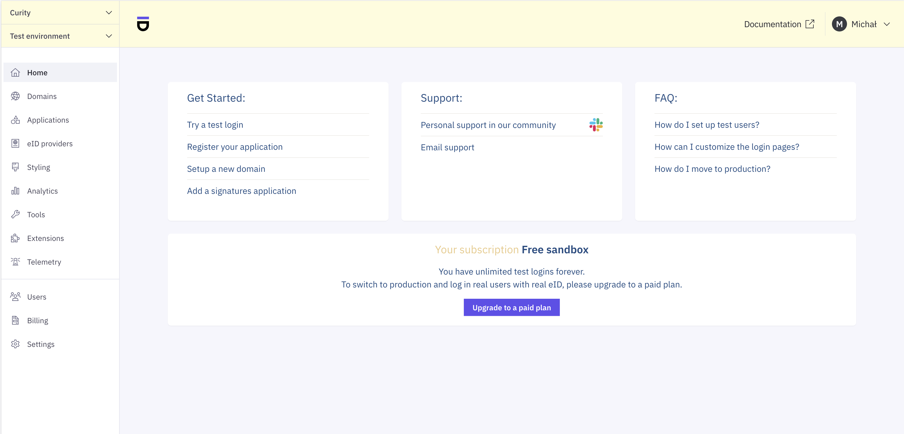
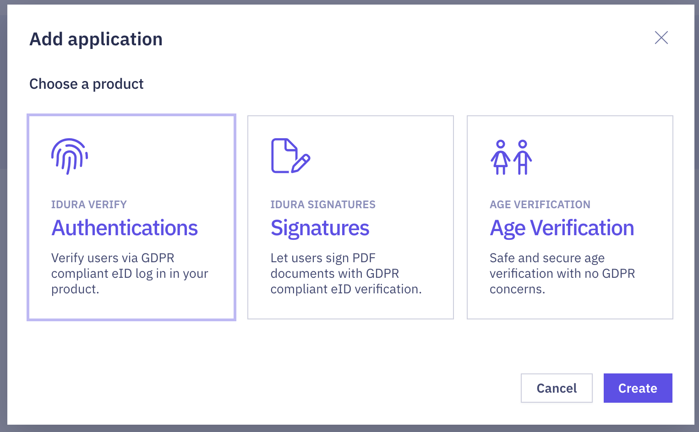
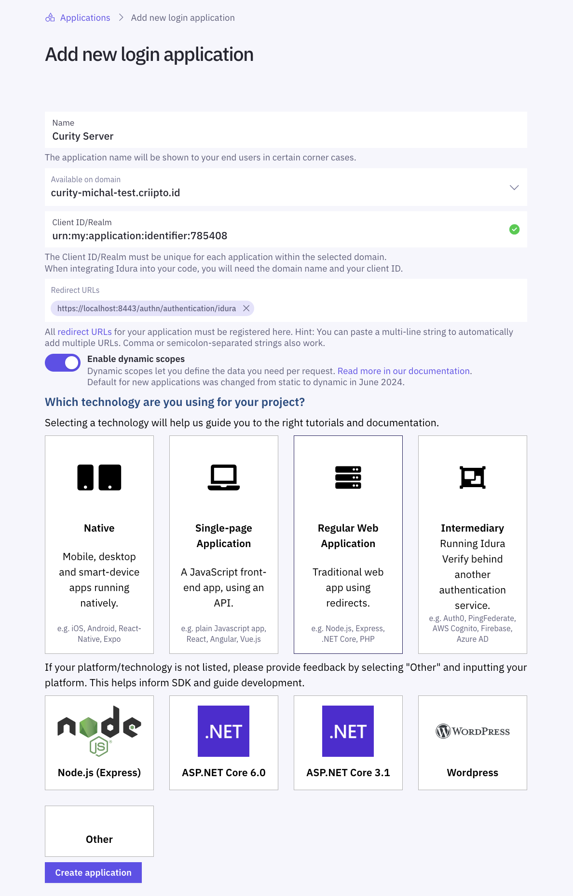

Idura Authenticator Plug-in
===========================

.. image:: https://img.shields.io/badge/quality-test-yellow
       :target: https://curity.io/resources/code-examples/status/

.. image:: https://img.shields.io/badge/availability-binary-blue
       :target: https://curity.io/resources/code-examples/status/

This project provides an open source Idura Authenticator plug-in for the Curity Identity Server. This allows adding functionality to the Curity Identity Server to enable end users to log in using one of the eID solutions provided by Idura.

Requirements for Building from Source
"""""""""""""""""""""""""""""""""""""

* Maven 3
* Java JDK v. 21 or later

Compiling the Plug-in from Source
~~~~~~~~~~~~~~~~~~~~~~~~~~~~~~~~~

To compile the plugin, run ``mvn package``.

Installation
""""""""""""

To install this plug-in, either download a binary version available from the `releases section of this project's GitHub repository <https://github.com/curityio/idura-authenticator/releases>`_ or compile it from source (as described above). If you compiled the plug-in from source, the package will be placed in the ``target`` subdirectory. The resulting JAR file or the one downloaded from GitHub needs to placed in the directory ``${IDSVR_HOME}/usr/share/plugins/idura``. (The name of the last directory, ``idura``, which is the plug-in group, is arbitrary and can be anything.) After doing so, the plug-in will become available as soon as the node is restarted.

If you run multiple Curity Identity Server nodes, make sure to deploy the JAR file to each run-time node and the admin node.

For a more detailed explanation of installing plug-ins, refer to the `Curity developer guide <https://curity.io/docs/identity-server/developer-guide/plugins/index.html#plugin-installation>`_.

Creating an account in Idura Verify
"""""""""""""""""""""""""""""""""""

Go to the `Idura Verify product page <https://www.idura.eu/>`_.
There, you can find links to both the signup page and pricing details for production usage.
For testing, you can create a free account. The free version contains all features, but you can only log in with test identities.

Follow the guide to create a tenant in Idura Verify, and you will end up on the dashboard:

Creating a connection to the Curity Identity Server from Idura Verify
"""""""""""""""""""""""""""""""""""""""""""""""""""""""""""""""""""""

First, you need to register a domain. Go to the **Domains** tab and follow the wizard to register a test domain.

Then, go to the **Applications** tab — this is the place where you define the integration with the Curity Identity Server.

Click on ``Add Application`` and choose ``Idura Verify, Authentications`` as the product type.

Give your application a suitable ``Name``.

The ``Client ID/Realm`` value is pre-filled with a unique value — you can change it to something more recognizable, if you want.
Take a note of this value, you will need to set it in the authenticator's configuration in the Curity Identity Server.

In the ``Redirect URLs`` input add the ``authentication`` endpoint of the Idura authenticator of your Curity Identity Server instance. See the `The Redirect URL For the Idura Application`_ section below to learn how to find that value.

Next, select ``Regular Web Application`` as the application type. The new application form should look similar to this:

Click ``Create application`` and copy the secret for your application. You will need it when configuring the authenticator in the Curity Identity Server.

You need to set a few more details for the integration to work correctly. Follow these steps:

1. Go to the ``OpenID Connect`` tab.
2. Select ``fromTokenEndpoint`` in the ``User info response strategy`` dropdown.
3. Make sure that ``compact`` is selected in the ``JWT property format`` dropdown.
4. Click ``Save``.
5. Switch to the ``Advanced options`` tab, and in the ``Frame origin`` field enter your Curity Identity Server's runtime host (and port, if non-standard). This is the base URL value that you set in your Curity Identity Server's admin UI in **System** -> **General**. Leave out the protocol from the value, Idura Verify adds that automatically.

    .. figure:: ./docs/images/idura-verify-advanced-options.png
        :align: center

6. Click ``Save``.

The Redirect URL For the Idura Application
~~~~~~~~~~~~~~~~~~~~~~~~~~~~~~~~~~~~~~~~~~

The value of the redirect URL is created using the following:

1. The base URL of your Curity Identity Server instance, e.g. ``https://localhost:8443`` or ``https://idsvr.example``. You can find this value in the admin UI in the **System** -> **General** tab.
2. The path to your authentication services's authentication endpoint, e.g. ``/authn/authentication``. You can find this value in the admin UI by going to **Profiles** -> **Authentication Service** -> **Endpoints**. Check the **Path** value for the endpoint with type ``auth-authentication``.
3. The id of your Idura authenticator, e.g. ``idura``. This is the name that you set for your Idura authenticator when configuring it in the Curity Identity Server (see below).
4. ``/callback`` suffix.

For example, the redirect URL might look similar to this: ``https://localhost:8443/authn/authentication/idura/callback``.

Configuring an Idura Authenticator in Curity
""""""""""""""""""""""""""""""""""""""""""""

Configuration using the Admin UI
~~~~~~~~~~~~~~~~~~~~~~~~~~~~~~~~

Log in to the admin UI of your instance of the Curity Identity Server, then follow these steps:

1. Go to **Profiles** -> **Authentication Service** ->  **Authenticators**.
2. Click the ``+ New Authenticator`` button.
3. Enter a suitable name (e.g., ``idura``) and choose the Idura type, then click ``Create``. Remember that this name must match the one you used in the redirect URL path in Idura.

    .. figure:: docs/images/idura-new-authenticator.png
        :align: center

4. Scroll down to the Idura settings section to set the required options. Paste the clientID, the secret, and the domain that you set up in Idura earlier.
5. If you need the Curity Identity Server to connect to Idura's endpoints (like the token or user info endpoint) using a forward proxy, then create an HTTP client with required settings. You can create the client by clicking on the three dots in the ``HTTP Client`` dropdown and selecting ``+ New``.
6. Choose the country whose eID you want to use to authenticate users. For instance, choose ``sweden`` to use the Swedish BankID, ``denmark`` for NemID, and ``norway`` for the Norwegian Bank ID. (Note that Idura offers more eID integrations. This plugin implements only these three.)
7. If you choose ``sweden`` or ``norway``, then you will see another configuration option where you can limit the way in which users will be allowed to authenticate with the given provider.

The final configuration can look similar to this:

    .. figure:: docs/images/idura-authenticator.png
        :align: center
        :width: 600px

8. To deploy the changes, click on ``Commit`` from the ``Changes`` menu in the top bar. You can enter a comment in the ``Deploy Changes`` dialogue. Then click ``OK``.

Once the configuration is committed and running, the authenticator can be used like any other — used as a second factor, as a prerequisite to other authenticators, or standalone. See `resources on authentication <https://curity.io/resources/learn/authentication-overview/>`_ or `the documentation <https://curity.io/docs/identity-server/profiles/authentication-profile/>`_ to learn more.

Configuration using the CLI
~~~~~~~~~~~~~~~~~~~~~~~~~~~

It is very common to create many instances of the Idura authenticator. For example, you may configure one for Swedish BankID using the same device and another for different devices. These may be put into a group or combined with other authenticators to provide a suite of Scandinavian eIDs. In such a case, you may find it simpler to use the CLI to configure instances of the authenticator. To do this, follow these steps:

1. Start the ``idsh`` command located in ``$IDSVR_HOME/bin``.
2. Enter configuration mode by typing ``configure`` and hitting Enter.
3. Next, define the new Idura authenticator instance in your authentication profile. For example, if the authentication profile is called ``foo``, then the following commands would create the authenticator:

    .. code-block::

        set profiles profile foo authentication-service settings authentication-service authenticators authenticator idura-se-other description "Other Device"
        set profiles profile foo authentication-service settings authentication-service authenticators authenticator idura-se-other idura
        set profiles profile foo authentication-service settings authentication-service authenticators authenticator idura-se-other idura client-id urn:my:application:identifier:785408
        set profiles profile foo authentication-service settings authentication-service authenticators authenticator idura-se-other idura client-secret QWxhZGRpbjpvcGVuIHNlc2FtZQ==
        set profiles profile foo authentication-service settings authentication-service authenticators authenticator idura-se-other idura sweden log-in-using other-device
        set profiles profile foo authentication-service settings authentication-service authenticators authenticator idura-se-other idura domain curity-michal-test.criipto.id

4. Type ``commit`` to make the configuration active.
5. Exit the shell by typing ``exit`` followed by Enter two times or just hit ``Ctrl-D`` a couple times.

For more information on the CLI, refer to this `introductory video <https://curity.io/resources/videos/cli-introduction/>`_.

Allowing Framing of Idura
"""""""""""""""""""""""""

The Idura authenticator frames the Idura Verify service, so that the look and feel can be styled using the Curity Identity Server's normal theming mechanisms. In order for this to be allowed by modern browsers, however, all OAuth clients and service provider apps that use this authenticator must be configured to allow framing.

The apps should allow the following value for framing: the URL of the ``authenticate`` endpoint of the given authentication service, followed by an asterisks. For example, if the base URL of your instance of the Curity Identity Server is ``https://idsvr.example`` and the authentication service exposes its authentication endpoint at ``https://idsvr.example/authn/authentication``, then use this value to allow framing: ``https://idsvr.example/authn/authentication/*``.

Getting Access To Idura Resources
"""""""""""""""""""""""""""""""""

Once the authentication in Idura Verify completes, the Curity Identity Server obtains an access token and ID token from Idura. These tokens are made available in the authentication flow as attributes (see ``handleCallbackResponse`` in the `CallbackRequestHandler <src/main/java/io/curity/identityserver/plugin/idura/authentication/CallbackRequestHandler.java>`_ class). You can then use the attributes in the authentication flow, in actions, or put them as claims in tokens issued by the Curity Identity Server (see `this claims tutorial <https://curity.io/resources/learn/claims-from-authenticated-subject/>`_ for details).

License
"""""""

This plugin and its associated documentation is listed under the `Apache 2 license <LICENSE>`_.

More Information
""""""""""""""""

Please visit `curity.io <https://curity.io/>`_ for more information about the Curity Identity Server.

Copyright (C) 2026 Curity AB.
